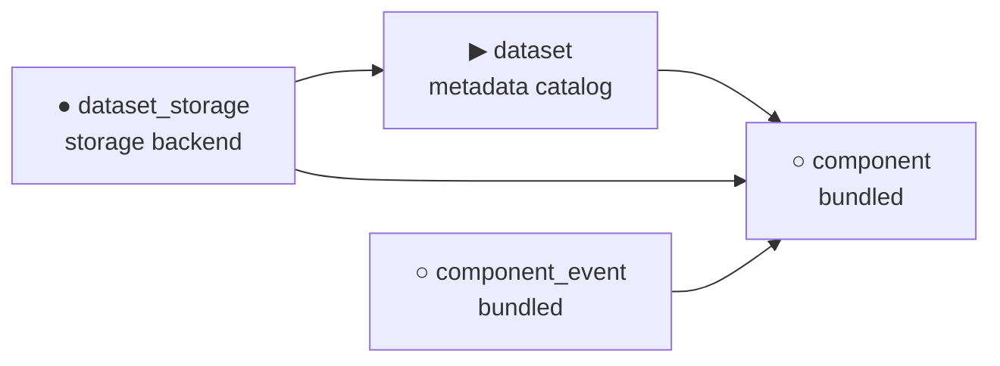

# Dataset Console

Odoo 19 monorepo providing dataset management and storage backends for AI/ML training and evaluation data.

---

## Addons

| Addon | Description |
| ---- | ----------- |
| [`dataset`](dataset/) | Metadata catalog — sources, packages, datasets, data chunks, manifests. Pure metadata; does not read/write payloads. |
| [`dataset_storage`](dataset_storage/) | Storage backend — `dataset.storage` model + fsspec-based components for physical storage (file, S3, GCS, …). Depends on `dataset` and [`component`](component/). |
| [`component`](component/) | OCA component framework — reusable registry for plugins/lazy-loaded services. Bundled; not installed on its own. |
| [`component_event`](component_event/) | Event dispatch for components. Bundled; not installed on its own. |

## Installation

1. Clone into your Odoo addons path.
2. Update the apps list.
3. Install **Dataset Management** (depends on `component`).
4. Optionally install **Dataset Storage** for payload I/O.

## Quick start

```python
source = env['dataset.source'].create({
    'name': 'Wikipedia',
    'code': 'wiki',
})

ds = env['dataset'].create({
    'name': 'Wiki sentences EN',
    'code': 'wiki_en_sent',
    'source_id': source.id,
    'chunk_type': 'jsonl',
    'key_fields': ['lang', 'shard'],
})

storage = env['dataset.storage'].create({
    'name': 'local',
    'config': {'protocol': 'file', 'root': '/var/lib/datasets'},
})
ds.storage_id = storage

# Create via storage
key = ds.build_chunk_key({'lang': 'en', 'shard': '0001'})
storage.write_key(key, b'{"text": "hello world"}')

# Or via chunk model
chunk = env['dataset.data_chunk'].create({
    'dataset_id': ds.id,
    'metadata': {'lang': 'en', 'shard': '0001'},
})
# chunk.key computed automatically
```

## Architecture



`dataset` is the metadata catalog. `dataset_storage` extends it with:

- `dataset.storage_id` on `dataset` — link to a storage backend.
- `dataset.data_chunk.raw_data` compute/inverse — reads/writes via storage.
- Components for each protocol (`fsspec` → `fsspec.filesystem()`).

Storage interface:

```python
storage.key_exist(key: str) -> bool
storage.read_key(key: str) -> bytes
storage.write_key(key: str, data: bytes) -> None
storage.delete_key(key: str) -> None
```

Compression is decided per-key: if the chunk type encoded in the key is in this storage's `gzip_chunk_types` (default `["csv", "json", "jsonl"]`), the payload is gzip-compressed and `.gz` is appended to the resolved path. Other extensions (parquet by default) pass through untouched.

## License

LGPL-3.