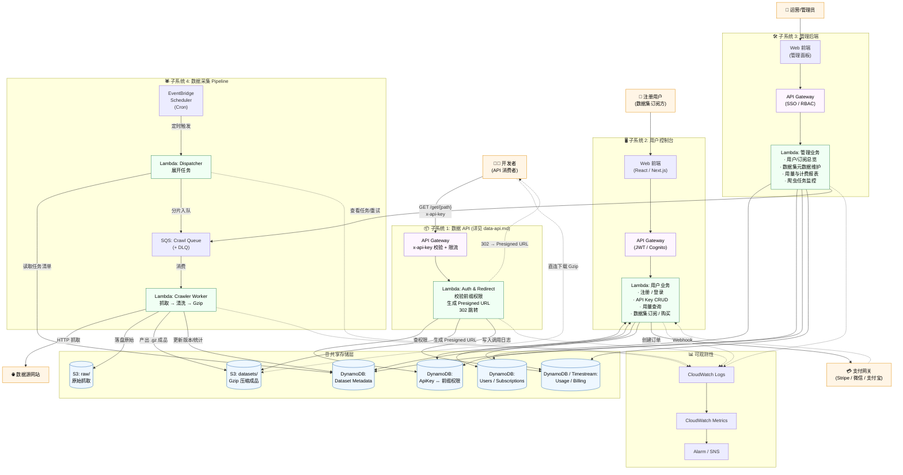
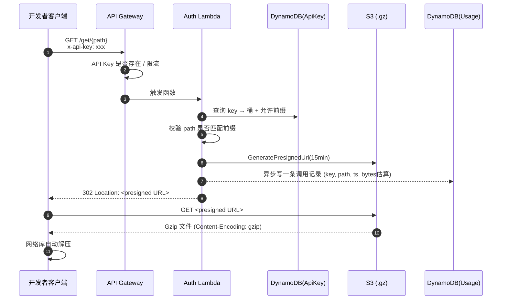
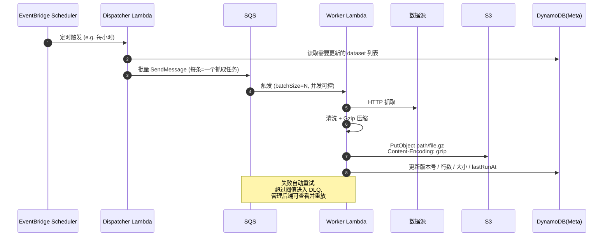
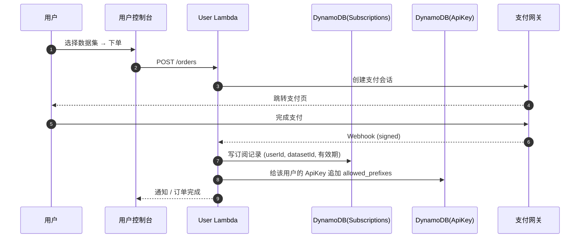

# 数据集服务平台 — 整体架构

## 一、系统总览

平台由四个相对独立、共享同一套存储与权限模型的子系统组成：

| 子系统 | 角色 | 主要使用者 |
|---|---|---|
| **数据 API**（Data API） | 鉴权 + 302 重定向，直连 S3/COS 下载 Gzip 压缩数据 | 第三方开发者（带 API Key 调用） |
| **数据采集**（Crawler Pipeline） | Scheduler 触发 → SQS 派发 → Lambda 爬取 → S3 落盘 | 平台内部，自动运行 |
| **管理后端**（Admin Console） | 查看订阅情况、数据集情况、用量统计、运营干预 | 平台运营 / 管理员 |
| **用户控制台**（User Console） | 注册登录、API Key 管理、用量查看、购买数据集 | 注册用户（数据消费方） |

---

## 二、整体架构图（C4 Container 视角）

---

## 三、关键时序图

### 3.1 开发者下载数据集（Data API 主链路）

### 3.2 数据采集 Pipeline

### 3.3 用户购买数据集

---

## 四、数据模型一览（DynamoDB 主要表）

| 表 | PK / SK | 关键字段 | 谁在写 | 谁在读 |
|---|---|---|---|---|
| `ApiKeys` | PK=`apiKey` | bucket, allowed_prefixes[], userId, status, rateLimit | User Console / Admin | Auth Lambda |
| `Users` | PK=`userId` | email, plan, createdAt | User Console | Admin / User |
| `Subscriptions` | PK=`userId` SK=`datasetId` | startAt, expireAt, source(order/trial) | User Console (支付回调) | All |
| `Datasets` | PK=`datasetId` | name, prefix, schema, version, sizeBytes, rowCount, lastRunAt | Crawler Worker / Admin | All |
| `Usage` | PK=`apiKey` SK=`yyyymmddhh#requestId` | path, bytes, status | Auth Lambda | Admin / User Console |

> Usage 表数据量大、写多读少，可改为 **Timestream / Kinesis Firehose → S3 + Athena**。

---

## 五、设计原则与边界

1. **完全 Serverless**：所有计算节点都是 Lambda，按调用计费、自动扩缩容、零运维。
2. **存储即数据合约**：`S3 datasets/{datasetId}/...` 的前缀就是权限模型的最小单位，API Key 持有"前缀白名单"即可。
3. **下载链路与业务链路解耦**：Data API 路径只做"鉴权 + 重定向"，不经手字节流，成本和延迟最低（详见 `data-api.md` 第五节成本对比）。
4. **管理后端只读为主**：通过共享 DynamoDB 表观察用户/订阅/数据集/用量；写操作仅限运营修订（封禁、重置 Key、重放 SQS）。
5. **DLQ + 监控闭环**：爬虫失败不丢，统一进入 DLQ；管理后端提供"查看 / 重放 / 标记已处理"。

---

## 六、双云对齐（与 data-api.md 保持一致）

| 角色 | AWS | 腾讯云 |
|---|---|---|
| 对象存储 | S3 | COS |
| 函数计算 | Lambda | SCF |
| API 入口 | API Gateway | API 网关 |
| 队列 | SQS | CMQ / TDMQ |
| 调度 | EventBridge Scheduler | 定时触发器 |
| 元数据 KV | DynamoDB | TcaplusDB / Redis |
| 指标日志 | CloudWatch | CLS + 云监控 |

> 整体拓扑双云 1:1 对应，迁移成本仅是"换 SDK 客户端"。
